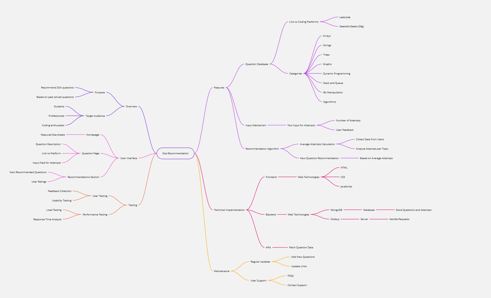

# Leetcode_Recommendation

Built a performance dashboard and recommendation system for solving DSA, utilizing all popular DSA sheets and tracking user attempts to suggest problems using Content-based filtering machine learning technique from weaker topics.

## Images

## Mind Map

## Process

### Tracking Attempts: 
Each time a user solves a problem, they input the number of attempts it took. This information is stored along with the problem details (such as the problem's topic or type, like "Arrays" or "Dynamic Programming").

### Topic-Level Aggregation:
As users solve more problems, the system aggregates the number of attempts for each topic. For example:

If a user solved 10 "Array" problems with a total of 30 attempts, we calculate the average attempts per problem for this topic (in this case, 3 attempts per "Array" problem).
Similarly, if they solved 5 "Graph" problems with a total of 20 attempts, we calculate the average for this topic (4 attempts per problem).
Identifying Weak Areas:

The higher the number of attempts, the harder a user finds that topic. Topics where users consistently take many attempts are considered weak areas.
The system continuously monitors these attempts and adjusts its understanding of the user's weak topics as they solve more problems.
### Content-Based Filtering: 
Using this insight, the recommendation system applies content-based filtering. It suggests new problems based on:

The user’s past behavior (attempts per topic).
The assumption that if the user struggles with "Graphs," the system will prioritize recommending more "Graph" problems for practice.
This method helps the user to practice topics where they need the most improvement.

### Summary:
Number of attempts acts as a proxy for the difficulty a user faces in solving a problem.
The system uses this data to identify the user's weaker topics (i.e., topics with higher attempts).
The recommendation system is driven by this insight and provides problems from weaker topics, allowing the user to focus on areas where they need more practice.
This personalized approach helps to improve the user's performance by concentrating on weaker areas until they demonstrate mastery by reducing the number of attempts per problem.

